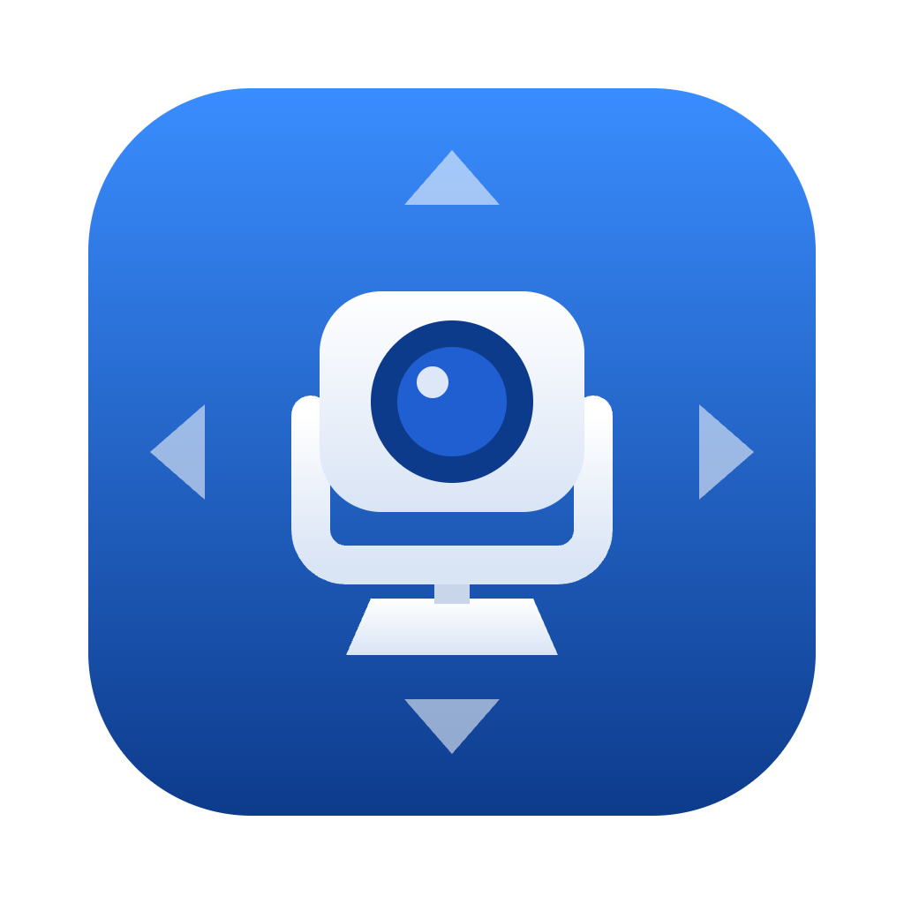
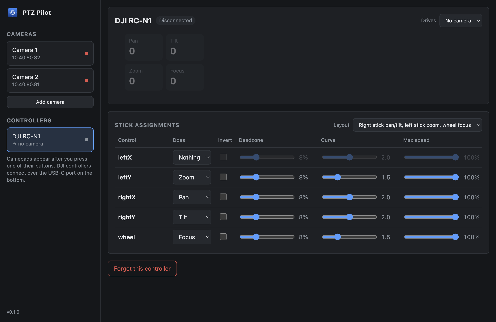
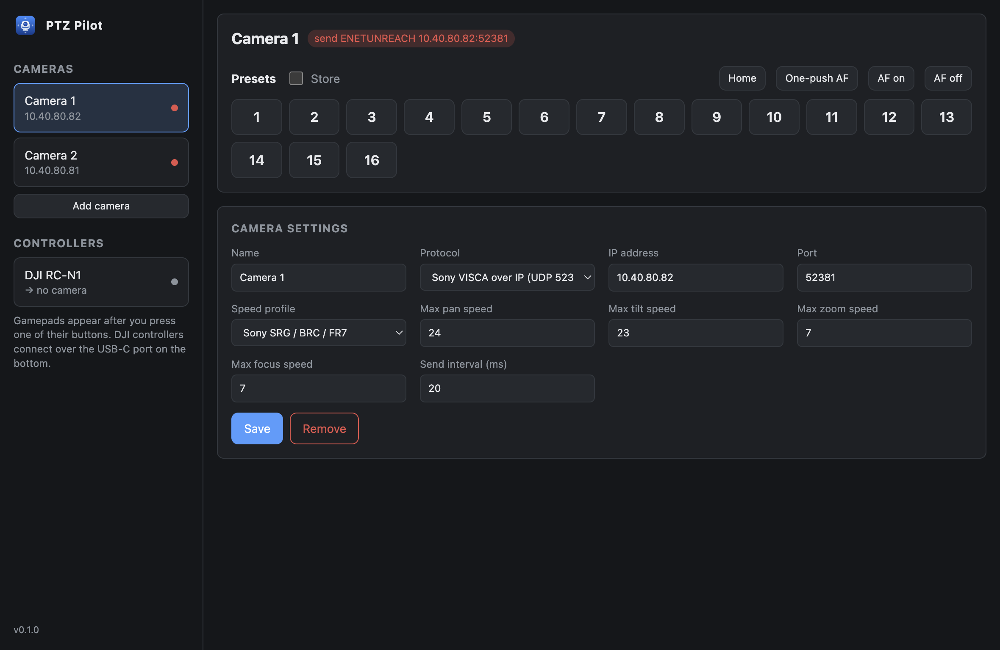

<p align="center">
  
</p>

<h1 align="center">PTZ Pilot</h1>

<p align="center">
  <strong>Fly your PTZ cameras with a game controller.</strong><br />
  Proportional pan, tilt, zoom and focus over VISCA — push further, move faster.
</p>

<p align="center">
  
  
  
  
</p>

---

<p align="center">
  
</p>

## ✨ Highlights

- 🎮 **Any controller** — Xbox, PlayStation, Switch Pro, 8BitDo and most other gamepads, over USB or Bluetooth. Even a spare **DJI drone remote**.
- 🎚️ **Truly proportional** — a gentle nudge creeps, full stick flies. Deadzone, response curve and top speed are tunable per axis.
- 👥 **Several operators at once** — every controller drives its own camera, with its own stick and button assignments.
- 🔀 **Switch cameras from the controller** — bumpers and D-pad step through cameras; face buttons recall presets.
- 🛟 **Built to fail safe** — a camera stops the moment its controller goes quiet, and every stop is sent twice.
- 🧭 **Lives in the menu bar** — close the window and keep flying; reassign controllers right from the menu.
- 🔌 **Remote control** — a WebSocket API and a Companion module for status, telemetry and control.

---

## 🎮 Controllers

| Controller                  | Connection                        | Sticks | Buttons |
| --------------------------- | --------------------------------- | :----: | :-----: |
| **Gamepads** (any brand)    | USB or Bluetooth, via Gamepad API |   ✅   |   ✅    |
| **Xbox controllers**        | USB or Bluetooth, direct HID      |   ✅   |   ✅    |
| **DJI RC-N1** (model RC231) | USB-C port on the bottom          |   ✅   |    —    |
| **Magicsee R1** ring        | Bluetooth, in game mode (@ + B)   |   ✅   |   ✅    |

- Gamepads show up once you press one of their buttons — a privacy rule of the Gamepad API.
- Xbox controllers are read directly over HID, independent of the app window. When HID has a controller, the Gamepad API's view of it is ignored, so it never drives a camera twice.
- The DJI remote reports its sticks and gimbal wheel on its bottom port, but not its buttons.
- The Magicsee R1 connects as a keyboard, so macOS asks for **Input Monitoring** the first time; allow it, then reopen PTZ Pilot. Its stick is only on or off, so movement eases in: tap to nudge, hold to build to full speed. While PTZ Pilot has it, its letters don't type into other apps.

Two controllers on the same camera share it: for each movement, whichever pushes harder wins.

---

## 📷 Cameras

| Protocol                      | Typical cameras                                        | Default port |
| ----------------------------- | ------------------------------------------------------ | :----------: |
| **Sony VISCA over IP** (UDP)  | Sony SRG / BRC / FR7, BirdDog, Lumens, Canon, Marshall |    52381     |
| **VISCA over UDP**, no header | PTZOptics, AVer and most generic cameras               |     1259     |
| **VISCA over TCP**            | PTZOptics and many generic cameras                     |     5678     |
| **Serial** RS-232 / RS-422    | Up to 7 cameras on a daisy chain                       |      —       |
| **Canon XC protocol** (HTTP)  | Canon CR-N / CR-X, XF605                               |      80      |
| **Hikvision ISAPI** (HTTP)    | Hikvision PTZ domes                                    |      80      |
| **Panasonic AW** (HTTP)       | Panasonic AW-HE / AW-UE                                |      80      |
| **Hanwha SUNAPI** (HTTP)      | Hanwha Vision Wisenet PTZ (XNP, QNP, PNM)              |      80      |
| **ONVIF** (HTTP)              | Hikvision, Dahua, Axis and most IP PTZ cameras         |      80      |
| **KXWell** serial or TCP      | KXWell heads, through a KT-RP8910 / KT-RP88810U panel  |      23      |

Speed profiles match each camera family's ranges, and every limit can be set by hand.

Canon's own XC protocol gives finer speed control than VISCA: pan and tilt run from 0.1°/s to 100°/s, and zoom has 128 speeds. If the camera doesn't allow guest access, enter its user name and password. Canon cameras keep presets 1–100.

Hikvision cameras always need a user name and password. Hikvision locks an account after a few failed logins, so if the camera rejects the password PTZ Pilot waits before trying again (from a minute, doubling up to half an hour); saving the camera's settings tries again straight away. Presets run from 1 up to the camera's own limit (usually 256 or 300); some numbers are reserved for built-in functions on many domes, so the camera may refuse to save them. PTZ Pilot talks to channel 1, so it drives a camera directly rather than through an NVR.

Panasonic AW-HE and AW-UE cameras are driven over Panasonic's own HTTP commands, with 49 speeds each way on every axis and presets 1–100. Panasonic asks for 130 ms between commands on its older models, so that is the starting send interval; newer models such as the AW-UE80 and AW-UE160 take a shorter one. A user name and password are only needed if the camera asks for them.

Hanwha Vision (Wisenet) PTZ cameras are driven over Hanwha's own SUNAPI and need a user name and password. Like Hikvision, they block logins after a few failures, so a rejected password makes PTZ Pilot wait before trying again. Speeds are percent of the camera's top speed; focus moves near or far at the camera's own speed. Presets run from 1 up to the camera's limit (usually 300), and saved ones are named "Preset1", "Preset2" and so on.

ONVIF cameras need a user name and password; **Find cameras** in the camera form lists the ones that answer on the local network. Speeds are percent of the camera's top speed, and preset _N_ is the camera's preset with token _N_ (or one named _N_ or "Preset _N_"). ONVIF has no one-push focus, so PTZ Pilot turns autofocus on for two seconds and then back to manual. Hikvision cameras ship with ONVIF switched off: in the camera's web page, turn on **Open Network Video Interface** under Configuration › Network › Advanced Settings › Integration Protocol, and add an ONVIF user there — the web admin login won't do.

KXWell robotic heads are driven through their control panel, from its REMOTE1 RS-232 port (9600 baud) or over IP. Give each head the address the panel knows it by, 1–255. There are 49 speeds each way on every axis and presets 1–100, but no home position or auto focus. The panel never answers, so a KXWell camera shows **No replies yet** even while it works; over IP, a closed connection still shows. PTZ Pilot powers the head on when it connects, and leaves it on when it quits.

> [!NOTE]
> Sony cameras send their replies to port **52381** on the controlling computer, so PTZ Pilot listens there. If another program already holds that port, cameras still move, but their status can't be shown.

<p align="center">
  
</p>

---

## 🕹️ Using it

1. **Add a camera** — pick its protocol, enter its address, choose a speed profile.
2. **Connect a controller** — it appears in the sidebar and starts on the camera you're looking at.
3. **Fly** — the speed tiles show exactly what's being sent.

### Stick assignments

Choose what each axis does — **pan, tilt, zoom, focus** or nothing — or pick a ready-made layout. Each axis has its own invert, deadzone, response curve and top speed.

### Buttons

| Out of the box     | Does                   |
| ------------------ | ---------------------- |
| Bumpers, D-pad ◀ ▶ | Previous / next camera |
| A · B · X · Y      | Recall presets 1–4     |
| Menu               | Home                   |
| View               | One-push autofocus     |

Any button can instead switch to a specific camera, recall any of presets 1–16, or change the focus mode.

---

## 🔌 Remote control

PTZ Pilot runs a **WebSocket API** at `ws://127.0.0.1:8765`, for camera and controller status,
live movement telemetry, and control: switch cameras, reassign controllers, recall and store
presets, and move cameras. The [Companion module](https://github.com/bitfocus/companion-module-josephadams-ptzpilot)
uses it.

The port, and whether other computers may connect, are under **Settings**. See the
**[API reference](docs/api.md)**.

---

## 🛟 Safety

- A camera stops within **250 ms** of its controller going quiet: unplugged, out of range or asleep.
- Every stop is sent **twice**, and a held movement is re-sent every **500 ms**, so a dropped UDP packet can't leave a camera turning.
- Quitting stops every camera before the app exits.

---

## 🛠️ Development

```bash
npm install
npm start          # build and run
npm test           # unit and loopback tests
npm run pack       # signed .app in release/, not notarized
npm run dist:mac   # signed, notarized DMGs for Apple Silicon and Intel
npm run icons      # re-render assets/*.png from the SVGs
```

<details>
<summary><strong>Signing, notarizing and releasing</strong></summary>

<br />

Notarization runs when `APPLE_ID`, `APPLE_APP_SPECIFIC_PASSWORD` and `APPLE_TEAM_ID` are set.

Pushing a `v*.*.*` tag builds, signs, notarizes and publishes a GitHub release. The workflow expects these repository secrets:

| Secret                       | What it is                                          |
| ---------------------------- | --------------------------------------------------- |
| `DEVELOPER_ID_CERT`          | Developer ID Application certificate, base64 `.p12` |
| `DEVELOPER_ID_CERT_PASSWORD` | Its password                                        |
| `APPLE_ID`                   | Apple ID used to notarize                           |
| `APPLE_ID_PASSWORD`          | App-specific password for that Apple ID             |
| `APPLE_TEAM_ID`              | Team ID                                             |

Set `PTZ_PILOT_USER_DATA` to run against a separate settings folder.

</details>

---

## 📄 License

MIT © Joseph Adams
